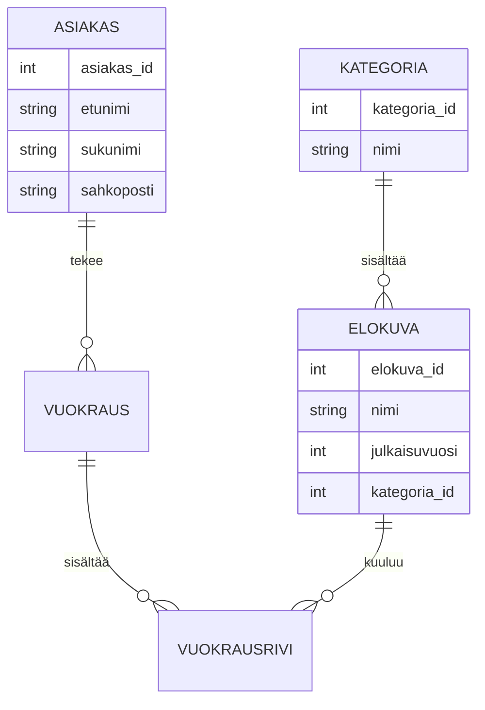

Elokuvavuokraamo tietokantojen harjoitustyö
## ER-kaavio

```mermaid
erDiagram
    KATEGORIA ||--o{ ELOKUVA : sisältää
    ASIAKAS ||--o{ VUOKRAUS : tekee
    VUOKRAUS ||--o{ VUOKRAUSRIVI : sisältää
    ELOKUVA ||--o{ VUOKRAUSRIVI : kuuluu

    KATEGORIA {
        int kategoria_id
        string nimi
    }
    ELOKUVA {
        int elokuva_id
        string nimi
        int julkaisuvuosi
        int kategoria_id
    }
    ASIAKAS {
        int asiakas_id
        string etunimi
        string sukunimi
        string sahkoposti
    }
```
