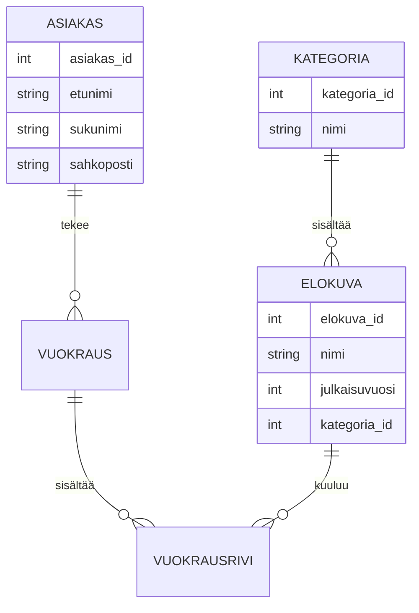

Elokuvavuokraamo tietokantojen harjoitustyö

Tämän järjestelmän tarkoituksena on hallinnoida elokuvia, niiden kategorioita, asiakkaita sekä vuokraustapahtumia.

## Vaatimusmäärittely

### Kohteet ja ominaisuudet
* **Elokuva**: Nimi, julkaisuvuosi, kuvaus ja kesto. Yksilöllinen tunniste (`elokuva_id`).
* **Kategoria**: Elokuvien luokittelu (esim. Sci-Fi, Komedia).
* **Asiakas**: Etunimi, sukunimi, sähköposti ja puhelinnumero. Yksilöllinen asiakasnumero.
* **Vuokraustapahtuma**: Yhdistää asiakkaan ja vuokrauksen ajan.
* **Vuokrausrivi**: Mahdollistaa useamman elokuvan vuokraamisen yhdellä kertaa.

### Kohteiden suhteet
* **Elokuva ja Kategoria**: 1:N-suhde (Elokuva kuuluu yhteen kategoriaan).
* **Asiakas ja Vuokraus**: 1:N-suhde (Asiakas voi tehdä useita vuokrauksia).
* **Elokuva ja Vuokraus**: M:N-suhde, joka toteutetaan `Vuokrausrivi`-liitostaulun avulla.

---

## Relaatiomalli

Tietokanta koostuu viidestä taulusta. Alaviivatut kentät ovat pääavaimia ja tähdellä (*) merkityt ovat viiteavaimia.

* **Kategoria** (<u>kategoria_id</u>, nimi)
* **Elokuva** (<u>elokuva_id</u>, nimi, julkaisuvuosi, kategoria_id*)
* **Asiakas** (<u>asiakas_id</u>, etunimi, sukunimi, sahkoposti)
* **Vuokraus** (<u>vuokraus_id</u>, vuokrauspvm, asiakas_id*)
* **Vuokrausrivi** (<u>rivi_id</u>, vuokraus_id*, elokuva_id*, palautuspvm)

## ER-kaavio

